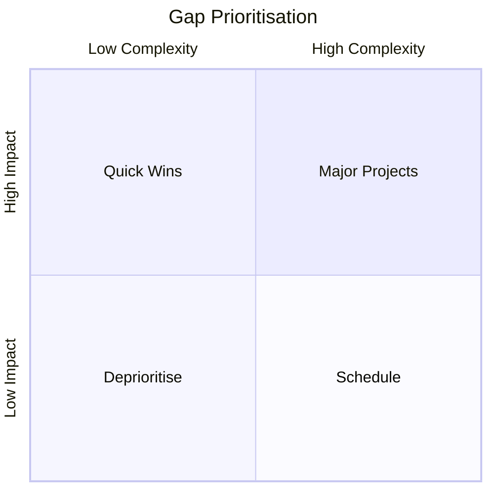
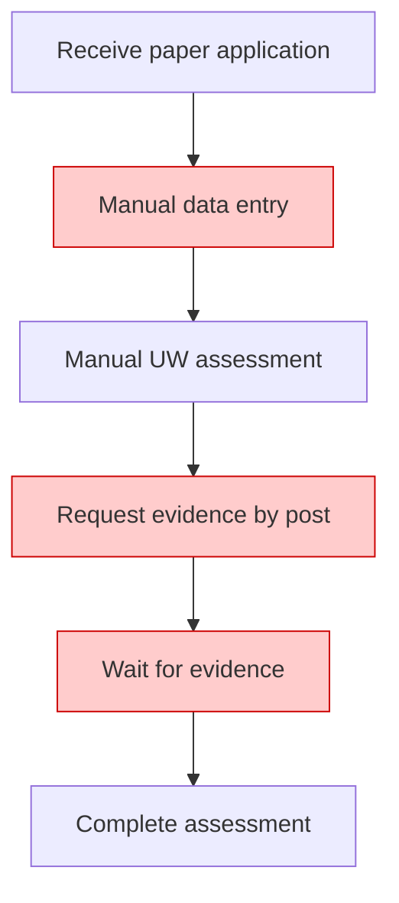

# Gap Analysis & Impact Assessment Guide

This reference covers current-vs-future state analysis, gap identification, impact assessments, and change readiness evaluation for insurance/financial services.

## Table of Contents
1. [Gap Analysis](#gap-analysis)
2. [Impact Assessment](#impact-assessment)
3. [Current vs Future State Mapping](#current-vs-future-state-mapping)
4. [Insurance Domain Considerations](#insurance-domain-considerations)
5. [Quality Checklist](#quality-checklist)

---

## Gap Analysis

### Purpose
Gap analysis identifies the delta between the current state ("as-is") and the desired future state ("to-be"), then defines the actions needed to close each gap. In insurance IT programmes, this typically covers processes, systems, data, people/skills, and regulatory compliance.

### Gap analysis structure (Excel format)

Create as an `.xlsx` workbook with these sheets:

**Sheet 1: Gap Register**

| Column | Description |
|---|---|
| Gap ID | Unique identifier (GAP-001, GAP-002) |
| Domain | Process / System / Data / People / Regulatory |
| Area | Specific function (e.g., Underwriting, Claims, Policy Admin) |
| Current state | Description of how things work today |
| Future state | Description of the desired target state |
| Gap description | What's missing or needs to change |
| Impact | High / Medium / Low — consequence of not closing the gap |
| Complexity | High / Medium / Low — difficulty of closing the gap |
| Priority | Based on impact × complexity |
| Remediation approach | How the gap will be closed (build, buy, configure, process change, training) |
| Owner | Who is responsible for closing the gap |
| Target date | When the gap should be closed |
| Dependencies | Other gaps or external factors |
| Status | Open / In Progress / Closed |

**Sheet 2: Summary Dashboard**
- Pivot table / chart showing gaps by domain, priority, and status
- Heat map of impact vs complexity

**Sheet 3: Detailed Analysis** (one per major area)
- Narrative format with current state description, future state vision, and gap details

### Gap categorisation

Classify gaps into these domains:

| Domain | What to assess |
|---|---|
| **Process** | Manual steps that should be automated, missing process steps, inefficient handoffs, lack of STP |
| **System/Technology** | Missing functionality, integration gaps, legacy limitations, platform constraints |
| **Data** | Data quality issues, missing data fields, data migration needs, reporting gaps |
| **People/Skills** | Training needs, new roles required, change management, knowledge gaps |
| **Regulatory** | Compliance gaps, new regulatory requirements, reporting obligations |
| **Governance** | Missing controls, audit trail gaps, approval workflows |

### Prioritisation matrix

Use a 2×2 or 3×3 matrix to prioritise gaps:

```
High Impact    | Quick Wins (do first)  | Major Projects (plan carefully)
Medium Impact  | Schedule              | Evaluate ROI
Low Impact     | Nice to have          | Deprioritise / park
               | Low Complexity        | High Complexity
```

Mermaid quadrant for visualisation:


---

## Impact Assessment

### Purpose
An impact assessment evaluates the effects of a proposed change across multiple dimensions: people, process, technology, data, regulatory, and financial. It informs go/no-go decisions and shapes the change management approach.

### Impact assessment structure

Produce as a `.docx` document or `.xlsx` depending on the audience:

#### 1. Change description
- What is being changed and why
- Scope of the change (which products, territories, business lines)
- Timeline and phasing

#### 2. Impact dimensions

For each dimension, assess:

| Dimension | Key questions |
|---|---|
| **People** | Who is affected? How many? What changes for their daily work? Training needed? Role changes? Redundancies? |
| **Process** | Which processes change? New processes needed? Processes retired? Handoff changes? SLA impacts? |
| **Technology** | Which systems are affected? New integrations? Data migration? Decommissioning? Performance impact? |
| **Data** | Data model changes? Migration required? Quality implications? Reporting impact? |
| **Regulatory** | Compliance implications? Regulatory notifications needed? Reporting changes? |
| **Financial** | Cost of change? Ongoing cost impact? Revenue impact? ROI? |
| **Customer** | Customer experience changes? Communication needed? Service disruption risk? |
| **Third party** | Impact on reinsurers, brokers, TPAs, vendors? Contract changes? |

#### 3. Impact rating

For each affected area, rate:

| Rating | Definition |
|---|---|
| **Critical** | Fundamental change to how work is done; extensive retraining; high risk of disruption |
| **High** | Significant change; new skills or tools required; noticeable process change |
| **Medium** | Moderate change; some adjustment needed; manageable with standard change process |
| **Low** | Minor change; minimal disruption; little or no training needed |
| **None** | No impact |

#### 4. Risk assessment

For each significant impact:
- Risk description
- Likelihood (High / Medium / Low)
- Impact severity (High / Medium / Low)
- Mitigation strategy
- Risk owner

#### 5. Readiness assessment

| Area | Ready? | Actions needed | Owner | Due date |
|---|---|---|---|---|
| Training materials | No | Develop e-learning modules | L&D team | 4 weeks before go-live |
| System environment | Partial | UAT environment needs refresh | DevOps | 2 weeks before UAT |
| Data migration | No | Cleanse legacy data, map fields | Data team | 6 weeks before go-live |
| Comms plan | Yes | — | Change manager | Done |

#### 6. Recommendations
- Go / No-Go / Go with conditions
- Key actions and owners
- Contingency plan if risks materialise

---

## Current vs Future State Mapping

### Comparison table format

| Aspect | Current state (As-Is) | Future state (To-Be) | Gap | Action required |
|---|---|---|---|---|
| Application intake | Paper forms, manual data entry | Digital e-application, pre-filled from broker data | No digital channel | Build e-app portal |
| Risk assessment | 100% manual underwriting | 70% auto-decision, 30% manual for complex | No decision engine rules | Configure rules in Magnum |
| Evidence management | Paper-based, physical filing | Digital evidence vault, OCR extraction | No document management platform | Implement DMS with OCR |
| Reinsurance cession | Manual bordereaux, quarterly | Real-time auto-cession via API | No system integration | Build API to reinsurer |
| MI & reporting | Monthly Excel reports | Real-time dashboards, self-serve BI | No BI platform | Implement Power BI / Foundry |

### Process comparison diagrams

Create two Mermaid diagrams side by side:
1. **As-Is process** — current state with pain points annotated
2. **To-Be process** — future state showing improvements

Annotate pain points in the as-is diagram using styled nodes:


Red-highlighted nodes indicate pain points or inefficiencies.

---

## Insurance Domain Considerations

When performing gap analysis or impact assessment in insurance, always consider:

### Regulatory dimensions
- **Solvency II**: Capital modelling, risk reporting, ORSA impact
- **IDD (Insurance Distribution Directive)**: Demands and needs, product governance, conflicts of interest
- **GDPR / Data Protection**: Data handling changes, consent management, retention periods
- **FCA Conduct**: Consumer Duty, fair value assessment, vulnerable customers
- **Lloyd's Standards**: If London Market, consider Lloyd's minimum standards, ECF, PPL

### Reinsurance-specific considerations
- Treaty vs facultative impact
- Cession rules and automatic capacity thresholds
- Bordereaux reporting format and frequency changes
- Retrocession implications
- Claims recovery process changes

### Actuarial & pricing impact
- Does the change affect risk selection or pricing assumptions?
- Impact on loss ratios, combined ratios
- Experience data continuity (will historical data remain comparable?)
- Reserving methodology changes

### Operational resilience
- Impact on business continuity plans
- Recovery time objectives (RTO) and recovery point objectives (RPO)
- Outsourcing and third-party dependency changes

---

## Quality Checklist

- [ ] All impact dimensions are assessed (people, process, tech, data, regulatory, financial, customer, third party)
- [ ] Gaps are uniquely identified and prioritised
- [ ] Current state is based on verified facts, not assumptions (validated with SMEs)
- [ ] Future state is clearly defined and aligned with programme vision
- [ ] Remediation actions have owners and target dates
- [ ] Regulatory and compliance implications are explicitly addressed
- [ ] Reinsurance and actuarial impacts are considered where relevant
- [ ] Risk assessment is included for high-impact changes
- [ ] Readiness assessment covers people, process, technology, and data
- [ ] Stakeholder sign-off process is defined for impact assessment conclusions
