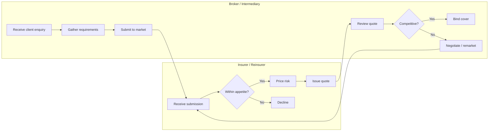
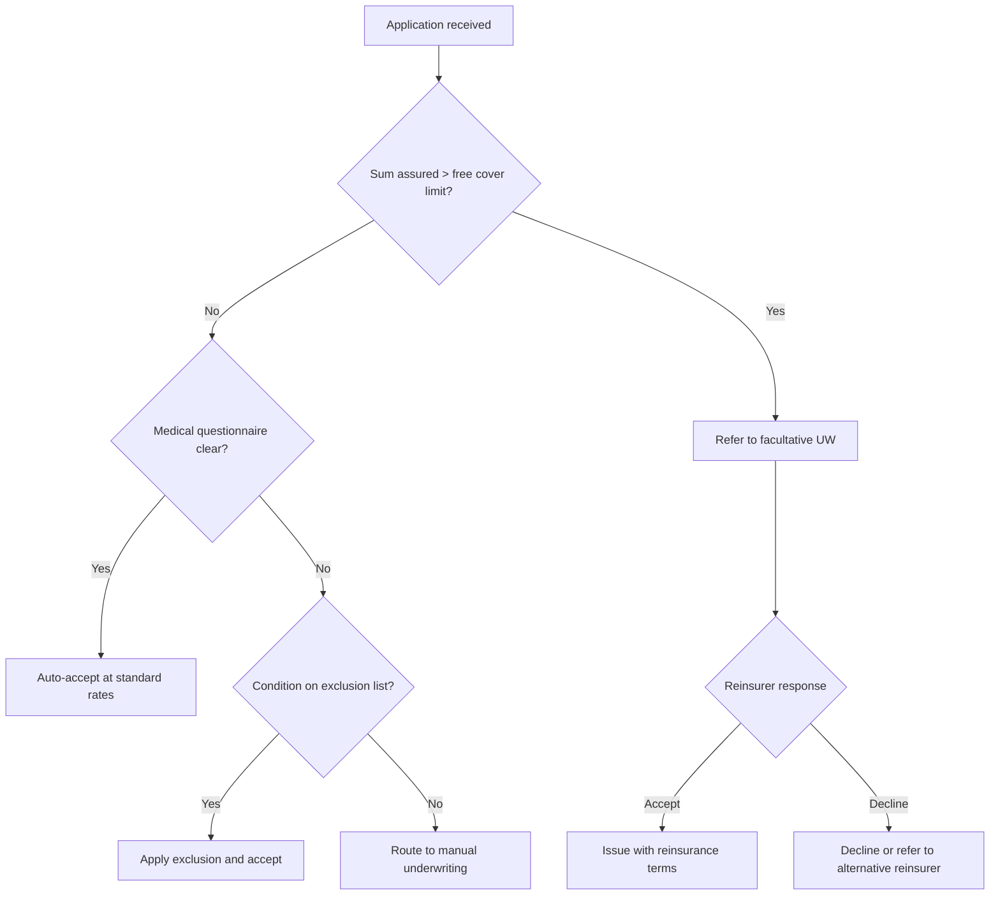
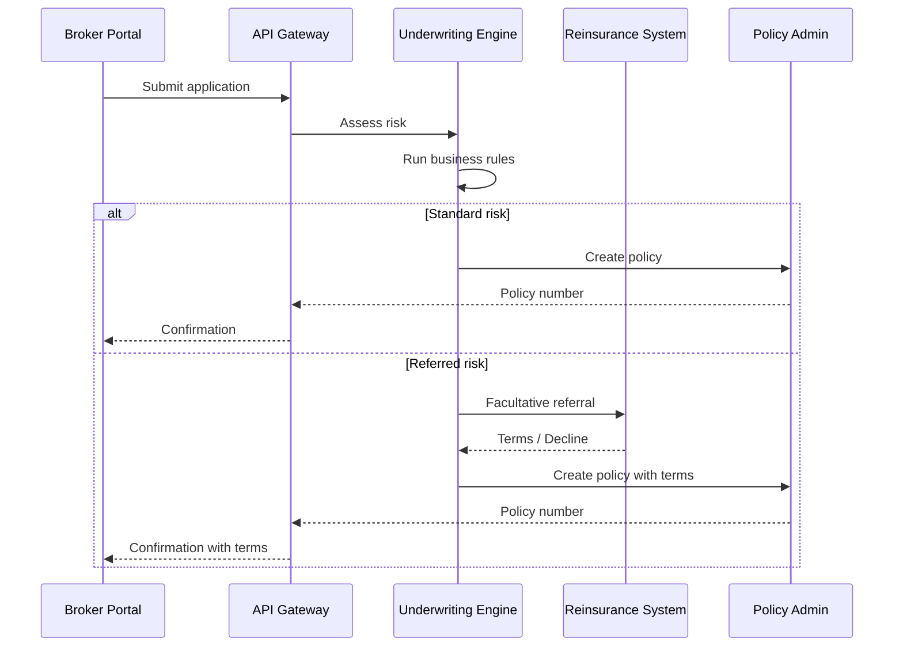
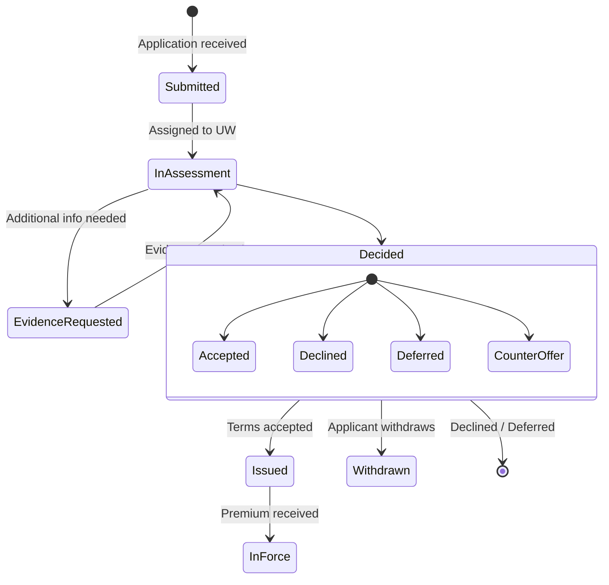

# Process Modelling Guide

This reference covers BPMN diagrams, swimlane flowcharts, and process documentation for insurance/financial services.

## Table of Contents
1. [When to Use Which Diagram Type](#when-to-use-which-diagram-type)
2. [Mermaid Flowchart Patterns](#mermaid-flowchart-patterns)
3. [BPMN Concepts in Mermaid](#bpmn-concepts-in-mermaid)
4. [Insurance Process Templates](#insurance-process-templates)
5. [Process Documentation Structure](#process-documentation-structure)
6. [Quality Checklist](#quality-checklist)

---

## When to Use Which Diagram Type

| Scenario | Diagram type | Mermaid syntax |
|---|---|---|
| Multi-department workflow | Swimlane flowchart | `flowchart` with `subgraph` |
| System state transitions | State diagram | `stateDiagram-v2` |
| Sequential process steps | Simple flowchart | `flowchart TD` or `LR` |
| Decision logic / business rules | Decision flowchart | `flowchart` with diamond nodes |
| Timeline / sequence of interactions | Sequence diagram | `sequenceDiagram` |
| High-level capability grouping | Mind map or block diagram | `mindmap` |

---

## Mermaid Flowchart Patterns

### Swimlane pattern (multi-actor process)

Use `subgraph` blocks to represent departments, roles, or systems:

### Decision tree pattern (underwriting rules)

### System interaction pattern (sequence diagram)

### State lifecycle pattern

---

## BPMN Concepts in Mermaid

Mermaid doesn't natively support full BPMN notation, but you can approximate key concepts:

| BPMN element | Mermaid approximation |
|---|---|
| Pool / Lane | `subgraph` |
| Task | Rectangle node `[Task name]` |
| Gateway (exclusive) | Diamond `{Decision?}` |
| Gateway (parallel) | Use multiple arrows from one node |
| Start event | `([Start])` or describe in first node |
| End event | `([End])` or terminal node |
| Timer event | Add note: `⏱ Wait 48hrs` |
| Message event | Use sequence diagram `-->>` |
| Sub-process | Nested `subgraph` |
| Data object | Use `[(Database)]` or note |

When full BPMN fidelity is needed and Mermaid falls short, describe the process in a structured table instead:

| Step | Actor | Action | Input | Output | Rules / Notes | System |
|---|---|---|---|---|---|---|
| 1 | Broker | Submit application | Proposal form, medical questionnaire | Application ID | Must include disclosure declaration | Portal |
| 2 | System | Triage | Application data | Risk category | See rules engine config | UW Engine |

---

## Insurance Process Templates

### New business underwriting (life)
Key stages to model:
1. Application capture (e-app, paper, broker submission)
2. Data validation and enrichment
3. Risk triage (auto-decide vs manual refer)
4. Evidence ordering (medical, financial, lifestyle)
5. Evidence receipt and chasing
6. Risk assessment and decision
7. Terms communication and acceptance
8. Policy issuance and welcome pack
9. Reinsurance cession

### Claims process (life & health)
Key stages:
1. FNOL (first notification of loss)
2. Claim registration and acknowledgement
3. Eligibility and coverage check
4. Evidence gathering (medical records, employer statements)
5. Assessment (medical, financial, legal)
6. Decision (accept, decline, partial, ex-gratia)
7. Payment processing
8. Reinsurance recovery
9. Case closure and MI

### Renewal / review process (group schemes)
Key stages:
1. Data request to client (census, claims experience)
2. Experience analysis
3. Rate review and pricing
4. Terms preparation
5. Broker negotiation
6. Scheme renewal confirmation
7. Member communication
8. System updates

---

## Process Documentation Structure

When a full process document is needed (not just a diagram), use this structure:

### 1. Process overview
- Process name and ID
- Process owner
- Objective / purpose
- Scope (what's included and excluded)
- Triggers (what initiates the process)
- Outcomes (what the process produces)

### 2. Process diagram
- Mermaid or reference to Visio/BPMN tool diagram
- Include all actors, decision points, and exception paths

### 3. Step-by-step description
For each step in the process:
- Step number and name
- Actor / role responsible
- Description of activity
- Inputs required
- Outputs produced
- Business rules applied
- Systems used
- SLA / time expectation
- Exception handling

### 4. Business rules summary
- Table of all decision rules referenced in the process
- Rule ID, description, condition, action

### 5. RACI for the process
- Cross-reference to RACI matrix

### 6. KPIs and SLAs
- Throughput, cycle time, error rate, STP rate
- How they're measured and reported

### 7. Risks and controls
- What can go wrong at each stage
- Controls in place (system validations, 4-eye checks, audit trails)

---

## Quality Checklist

- [ ] All actors/roles are identified and appear in swimlanes
- [ ] Every decision point has all possible outcomes shown
- [ ] Happy path is clearly distinguishable from exception paths
- [ ] Start and end points are explicit
- [ ] No orphan nodes (every node connects to something)
- [ ] System interactions are identified where relevant
- [ ] SLAs or time expectations are noted for key steps
- [ ] Regulatory touchpoints are flagged (e.g., disclosure, cooling-off, data retention)
- [ ] The diagram is readable — not more than ~15-20 nodes without breaking into sub-processes
