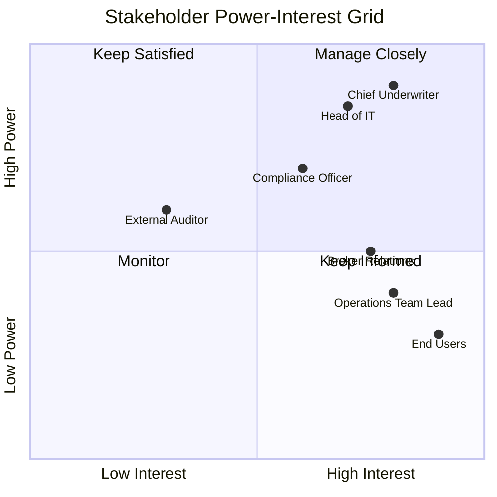

# Stakeholder Analysis & RACI Guide

This reference covers stakeholder mapping, analysis, RACI matrices, and communication plans for insurance/financial services programmes.

## Table of Contents
1. [Stakeholder Analysis](#stakeholder-analysis)
2. [RACI Matrix](#raci-matrix)
3. [Communication Plan](#communication-plan)
4. [Insurance-Specific Stakeholder Roles](#insurance-specific-stakeholder-roles)
5. [Quality Checklist](#quality-checklist)

---

## Stakeholder Analysis

### Stakeholder register

Create a stakeholder register as an Excel spreadsheet with these columns:

| Column | Description |
|---|---|
| Stakeholder name | Individual or role |
| Title / Position | Job title |
| Organisation / Department | Team or company |
| Interest | What they care about in this initiative |
| Influence | Their power to affect the project (High/Medium/Low) |
| Impact | How much the project affects them (High/Medium/Low) |
| Current attitude | Supportive / Neutral / Resistant |
| Desired attitude | Where you need them to be |
| Engagement strategy | How you'll engage them |
| Communication frequency | How often |
| Key concerns | Risks or objections they may raise |
| RACI role | R, A, C, or I for key deliverables |

### Power-Interest grid (Mermaid quadrant)

Use a Mermaid quadrant chart to visualise stakeholder positioning:

Quadrant strategies:
- **Manage closely** (high power, high interest): Regular engagement, involve in decisions
- **Keep satisfied** (high power, low interest): Periodic updates, escalation path
- **Keep informed** (low power, high interest): Regular comms, feedback channels
- **Monitor** (low power, low interest): Light touch, periodic updates

---

## RACI Matrix

### RACI definitions

| Letter | Role | Rule |
|---|---|---|
| **R** - Responsible | Does the work | At least one R per activity |
| **A** - Accountable | Ultimately answerable, has sign-off authority | Exactly ONE A per activity |
| **C** - Consulted | Provides input before the work is done (two-way) | As needed |
| **I** - Informed | Notified after the work is done (one-way) | As needed |

### RACI construction rules

1. Every row (activity/deliverable) must have exactly one A
2. Every row must have at least one R
3. Minimise the number of C's — too many consultees slows decisions
4. If someone is both R and A, mark as R/A
5. If a role has no letters in a row, they're not involved — that's fine
6. Review for overloaded roles: if one person is R on everything, that's a bottleneck

### RACI output format (Excel)

Create as an `.xlsx` with:
- Rows: Activities, deliverables, or decisions
- Columns: Roles or named individuals
- Cells: R, A, C, I, or blank
- Conditional formatting: colour-code R (blue), A (red), C (yellow), I (green)
- Include a summary row showing count of R, A, C, I per person to spot overload

### Example RACI for underwriting transformation programme

| Activity | Product Owner | Business Analyst | Scrum Master | Dev Lead | UW SME | Compliance | Sponsor |
|---|---|---|---|---|---|---|---|
| Define business requirements | C | R | I | C | C | C | A |
| Write user stories | A | R | I | C | C | I | I |
| Sprint planning | C | C | R | R | I | I | I |
| Solution design | C | C | I | R/A | C | C | I |
| UAT test scripts | C | R | I | C | R | C | A |
| Regulatory impact assessment | I | R | I | I | C | R/A | I |
| Go/No-Go decision | C | I | I | C | C | C | R/A |
| Change communication | C | C | R | I | I | I | A |

---

## Communication Plan

### Structure

| Element | Description |
|---|---|
| Audience | Who receives this communication |
| Message | Key content / purpose |
| Channel | Email, meeting, Slack, newsletter, town hall |
| Frequency | Daily, weekly, bi-weekly, monthly, ad-hoc |
| Owner | Who prepares and sends it |
| Format | Slide deck, email, dashboard, written report |
| Feedback mechanism | How recipients can respond |

### Example communication plan entries

| Audience | Message | Channel | Frequency | Owner |
|---|---|---|---|---|
| Steering Committee | Programme status, risks, decisions needed | Slide deck + meeting | Bi-weekly | Programme Manager |
| Product Owner & BA | Sprint progress, impediments | Stand-up | Daily | Scrum Master |
| UW SMEs | Requirement validation, demo feedback | Workshop / Teams | Weekly | Business Analyst |
| Compliance | Regulatory impact updates | Email + meeting | Monthly | BA / Compliance lead |
| Broker community | Change preview, training schedule | Newsletter / webinar | Monthly (pre-go-live) | Change Manager |
| End users (UWs) | Training, go-live preparation | Email + training sessions | As per schedule | Training lead |

---

## Insurance-Specific Stakeholder Roles

Common stakeholders in insurance/reinsurance IT programmes:

### Business stakeholders
- **Chief Underwriter / Head of UW**: Ultimate decision authority on risk rules and philosophy
- **Head of Claims**: Owns claims processes and assessment criteria
- **Chief Actuary / Pricing Actuary**: Owns pricing models, experience analysis
- **Head of Operations / COO**: Owns operational efficiency and STP targets
- **Head of Distribution**: Owns broker/agent relationships and channel strategy
- **Product Manager**: Owns product design, T&Cs, pricing structure
- **Compliance Officer / Head of Compliance**: Regulatory adherence, conduct risk
- **Chief Risk Officer**: Enterprise risk, operational risk
- **CFO / Finance Director**: Budget, financial reporting, Solvency II

### Technology stakeholders
- **CTO / Head of IT**: Technology strategy, architecture decisions
- **Enterprise Architect**: Integration, platform standards
- **Development Lead / Tech Lead**: Technical delivery
- **QA Lead**: Testing strategy, quality gates
- **InfoSec / CISO**: Security, data protection, access controls
- **Data Officer / Head of Data**: Data governance, MI, analytics

### External stakeholders
- **Reinsurance partners**: Treaty and fac terms, cession rules
- **Broker partners / MGAs**: Distribution, submission workflows
- **Regulators** (FCA, PRA, Lloyd's): Compliance requirements
- **Third-party data providers**: Medical databases, credit checks, fraud databases
- **Outsourced service providers**: TPA, BPO partners

---

## Quality Checklist

- [ ] All key stakeholders identified (business, technology, external)
- [ ] Power-interest grid or equivalent classification is complete
- [ ] RACI has exactly one A per activity
- [ ] No single role is overloaded with R assignments
- [ ] Communication plan covers all stakeholder segments
- [ ] Engagement strategy addresses any resistant stakeholders
- [ ] Insurance-specific regulatory stakeholders (compliance, risk) are included
- [ ] External stakeholders (reinsurers, brokers, regulators) considered where relevant
